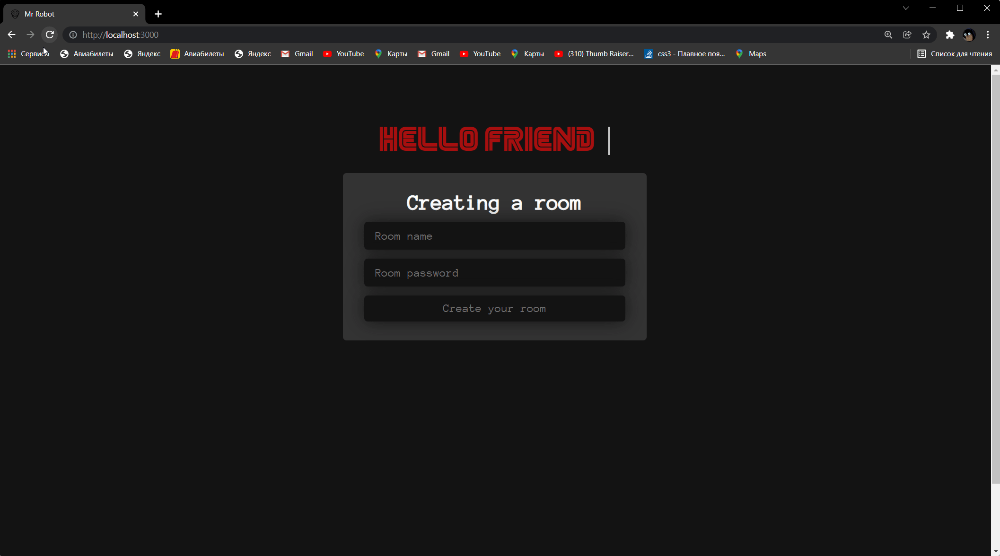
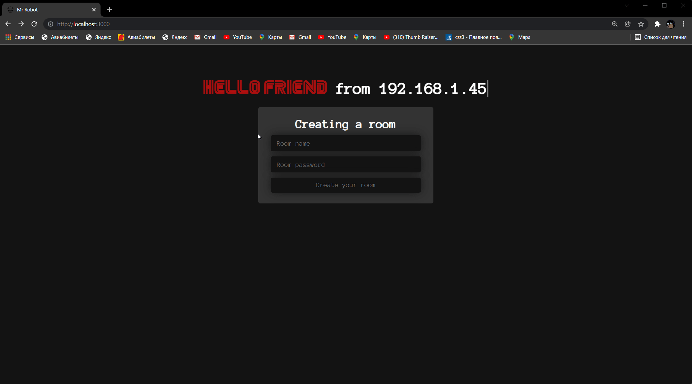
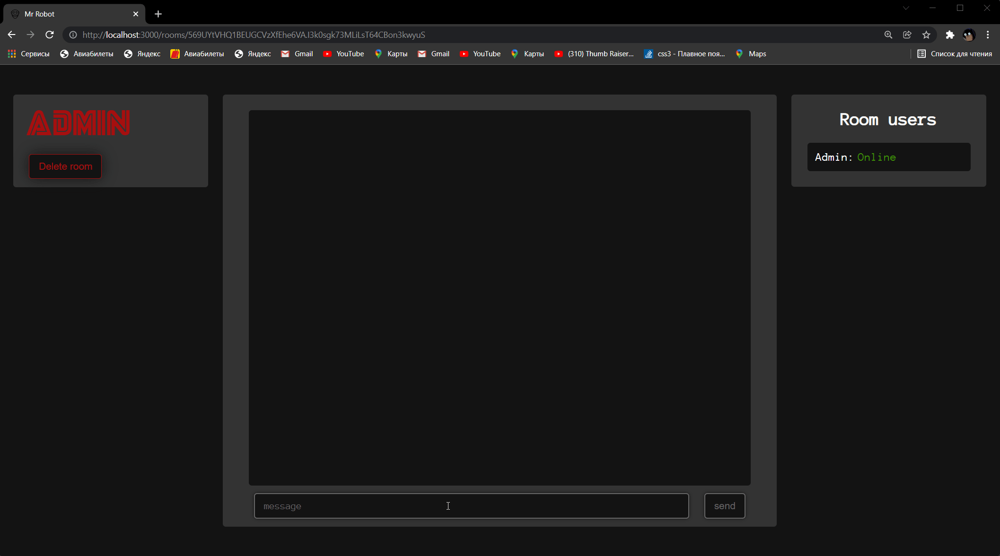
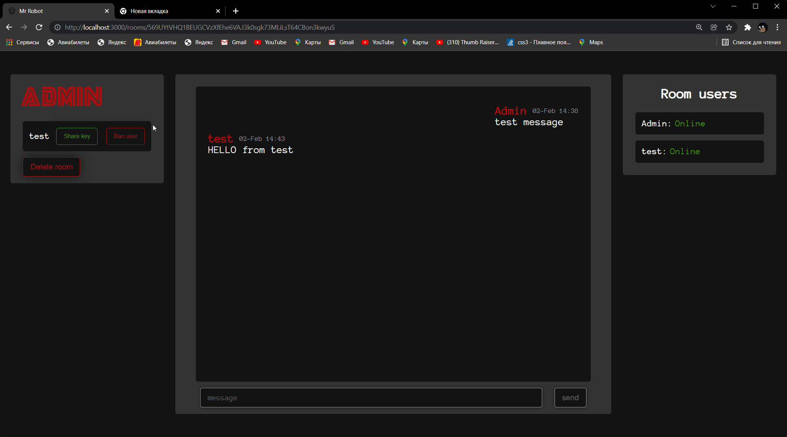

# React + FastAPI · [](LICENSE) [](https://github.com/psf/black)

<div>

 

 
</div>

A small Web Messenger with **[End-to-End](https://en.wikipedia.org/wiki/End-to-end_encryption)**  encryption 

---
## Features

- **[FastAPI](https://fastapi.tiangolo.com/)** (Python 3.9)
  - JWT authentication
- **[React](https://reactjs.org/)** (with Typescript)
  - [react-router v6](https://reactrouter.com/docs/en/v6/getting-started/overview/) to handle routing
  - [react-hooks](https://reactjs.org/docs/hooks-intro.html)
  - [axios](https://github.com/axios/axios) to send requests
- **[SqlAlchemy](https://www.sqlalchemy.org/)** for ORM
- **[Pytest](https://docs.pytest.org/en/latest/)** for backend tests
- **[Prettier](https://prettier.io/)**/**[ESLint](https://eslint.org/)** (Typescript)
- [Black](https://github.com/psf/black) (Python)

## Docker
```bash
git clone https://github.com/Flict-dev/Web-messenger.git
docker compose up
```
Go to http://localhost:8000/


## Quick Dev Start
- Run Backend
  - Create virtual environment <br>
     ```bash 
      python -m venv env
      ```
   - Activate virtual environment
       ```bash 
        Windows: env/Scripts/activate 
        Linux: source env/bin/activate
       ```
    - Install requirements
       ```bash 
       pip install -r requirements.txt
       ```
    - Run FastAPI server
       ```bash
        cd backend
        cd app
        uvicorn main:app --host '<ip>' --port <port> 
        ```
- Run Frontend
  - Install all node packages
    ```bash 
    cd frontend
    npm install
    ```
  - Run react server
    ```bash 
    npm start
    ```

## Examples

### Home page


### Creating a room


### Message
 

### Adding other users
To add a new user, it is enough to share a link
 

### Sharing the encryption key
The user needs an encryption key to decrypt other people's messages and send their own


### User status
Users have online and offline statuses


### Ban users
Admin can ban users


### Deleting a room
When deleting a room, users and their messages are also deleted


